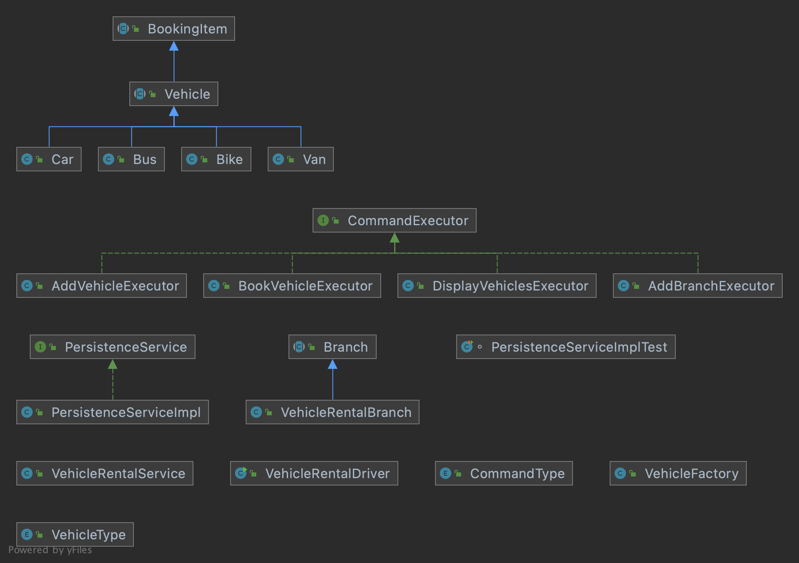

### Vehicle Rental System
Vehicle Rental System is a JAVA application to rent different kinds of vehicles such as cars and bikes.

### How to Run 
 Run the following from command line
 1. java -jar VehicleRental.jar ./src/input/WithoutSurge.txt
 2. java -jar VehicleRental.jar ./src/input/WithSurge.txt

### Class Diagram

### Design Patterns Used
1. Factory Pattern
2. Command Pattern

